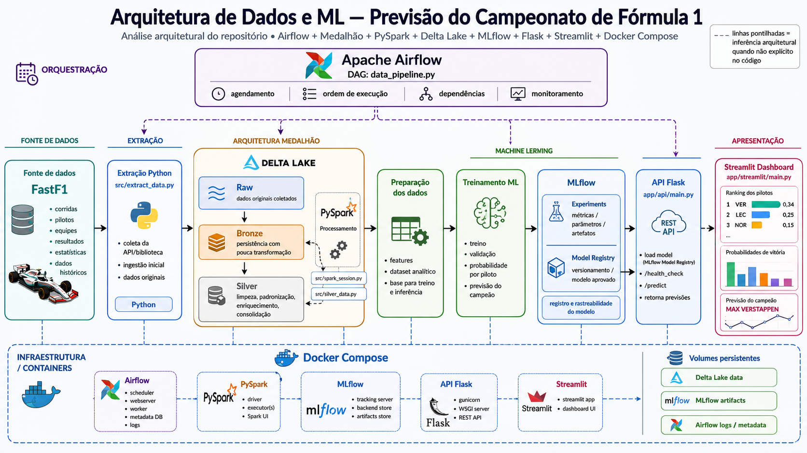

# Lake FastF1



Lake FastF1 is a long-term data engineering and machine learning project focused on Formula 1 data. It combines data ingestion, lakehouse-style transformations, and a lightweight prediction experience powered by a trained model.

## What this project does

The project collects Formula 1 race and session results using the FastF1 library, processes them through a multi-layer data pipeline, and prepares curated datasets for analytics and prediction.

The workflow includes:

- Extracting raw race/session results from Formula 1 events.
- Storing the raw data in Parquet files.
- Consolidating the data into a Bronze layer with Delta Lake.
- Creating Silver-layer datasets for champions, driver statistics, and analytical tables.
- Exposing predictions through a **FastAPI** service and an interactive **Streamlit** dashboard.

## Architecture

The project follows a practical data platform structure:

- **Raw layer**: initial extracted results stored as Parquet files.
- **Bronze layer**: consolidated data tables stored in Delta format.
- **Silver layer**: curated analytical datasets prepared for reporting and model consumption.
- **Orchestration**: an Airflow DAG runs the pipeline on a scheduled basis.
- **Serving layer**: a FastAPI service and a Streamlit dashboard consume the processed data and machine learning outputs.

```
┌──────────────────────────────────────────────────────────────────┐
│                        Data Pipeline (Airflow)                    │
│                                                                    │
│  FastF1 ──► Raw (Parquet) ──► Bronze (Delta) ──► Silver (Delta)  │
└──────────────────────┬─────────────────────────────────┬──────────┘
                       │                                 │
               ┌───────▼───────┐                 ┌──────▼──────┐
               │  FastAPI :5002│                 │  MLflow     │
               │  /predict     │◄────model────── │  (tracking) │
               └───────┬───────┘                 └─────────────┘
                       │
               ┌───────▼────────┐
               │ Streamlit :8501│
               │  Dashboard     │
               └────────────────┘
```

## Main technologies

| Layer | Technology |
|---|---|
| Data access | FastF1 |
| Data processing | Pandas, NumPy, PySpark |
| Storage | Delta Lake (Bronze/Silver) |
| Orchestration | Apache Airflow |
| Prediction API | **FastAPI** + Uvicorn |
| Dashboard | Streamlit + Plotly |
| Model tracking | MLflow |
| Package management | **uv** |
| Deployment | Docker, Docker Compose |

## Repository structure

```
lake-fastf1/
├── app/
│   ├── api/            # FastAPI prediction service
│   │   ├── main.py
│   │   ├── pyproject.toml
│   │   └── Dockerfile
│   └── streamlit/      # Interactive dashboard
│       ├── main.py
│       ├── pyproject.toml
│       └── Dockerfile
├── dags/               # Airflow DAG definitions
├── src/                # ETL: extraction, transformation, Spark logic
├── data/               # Raw, Bronze, Silver datasets (gitignored)
├── pyproject.toml      # Root uv project
├── docker-compose.yml
└── Dockerfile          # Airflow image
```

## Getting started

Run the project locally with Docker Compose:

```bash
docker compose up --build -d
```

Services exposed:

| Service | URL |
|---|---|
| Airflow | http://localhost:8080 |
| FastAPI | http://localhost:5002 |
| FastAPI Swagger | http://localhost:5002/docs |
| Streamlit | http://localhost:8501 |

### Environment variables

Copy `.env.example` to `.env` and fill in the values:

```env
AWS_KEY=
AWS_SECRET_KEY=

AIRFLOW_VERSION=3.3.0
AIRFLOW_PORT=8080
AIRFLOW_UID=1000

API_PORT=5002

PATH_RAW="data/raw"
PATH_BRONZE="data/bronze"
PATH_SILVER="data/silver"
PATH_QUERIES="src/queries"

FORMAT_READ="parquet"

MLFLOW_URI="http://mlflow_ip:5050/"
MLFLOW_MODEL_REGISTERED="model_name"
MLFLOW_EXPERIMENT_NAME="experiment_name"

STREAMLIT_PORT=8501
```

| Variable | Description |
|---|---|
| `PATH_RAW` | Directory where extracted Parquet files are stored. |
| `PATH_BRONZE` | Directory where consolidated Bronze tables are stored. |
| `PATH_SILVER` | Directory where processed Silver tables are stored. |
| `PATH_QUERIES` | Directory containing SQL files used by the transformation layer. |
| `MLFLOW_URI` | Tracking server URI used by the API and training scripts. |
| `MLFLOW_MODEL_REGISTERED` | Name of the registered model served by the API. |
| `API_PORT` | Port exposed by the FastAPI service (default `5002`). |

## Dashboard

The Streamlit dashboard shows predicted championship win probabilities per driver, updated after each race.

Features:
- **KPI row** — top-3 drivers with their latest win probability.
- **Interactive Plotly chart** — win probability over time per driver, colored by team, with hover tooltips.
- **Data tab** — pivot table of win probabilities and full feature table.
- Driver and season multi-select filters.

## API

The FastAPI service loads the latest registered model from MLflow and serves predictions via `POST /predict`.

```bash
# Health check
curl http://localhost:5002/health_check

# Predict
curl -X POST http://localhost:5002/predict \
  -H "Content-Type: application/json" \
  -d '{"values": [{"id": "...", "feature_1": 1.0, ...}]}'
```

Interactive documentation is available at `http://localhost:5002/docs`.

## Why this is a long-term project

This repository is designed as a long-term initiative rather than a one-off experiment. The pipeline is expected to evolve continuously as new data sources, validation rules, performance improvements, and modeling requirements are introduced.

Ongoing areas of improvement:

- Data quality checks and pipeline reliability
- Scheduling and backfill behavior
- Table design and business logic
- Model retraining and evaluation
- Observability, monitoring, and operational robustness
